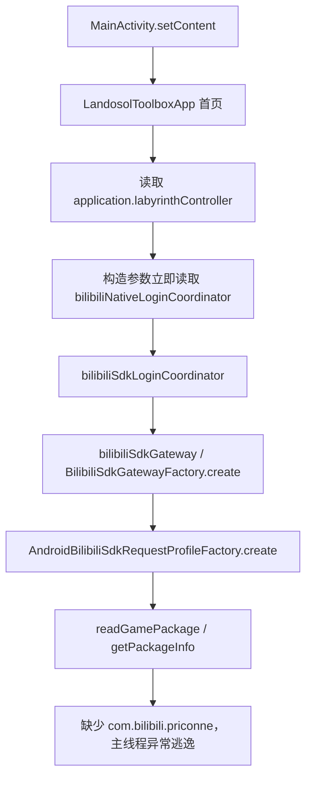

# Development Baseline

> 当前阶段结果见文末 Compatibility Bootstrap：修复版首页 3 次冷启动成功，lint 0 errors，15 项定向测试通过。此前章节保留为历史基线。

检查日期：2026-09-13（Australia/Sydney）。本轮仅建立未修改业务代码的构建与启动证据，不进行渠道适配、协议修改或功能开发。

## Git

- Repository: `C:\Users\ALEINWARE\Desktop\limingjie_clone\limingjie-assistant`
- 当前 Branch: `compat/xiaomi-ldplayer`
- origin: `https://github.com/g1ovell/limingjie-assistant.git`
- upstream: `https://github.com/wbero/limingjie-assistant.git`
- commit: `6b69920f29d3f622aad464598dc25bf910fedcd7`
- 初始状态：working tree clean，与 `origin/compat/xiaomi-ldplayer` 同步。
- 实际 origin 用户名是 `g1ovell`（数字 1），用户说明中写作 `glovell`（字母 l）；已明确报告，未改动 remote。
- 未重新 clone、fork、创建分支、切换 main、commit 或 push。

## Project

| 项目 | 源码配置 |
|---|---|
| 语言 / 模块 | Kotlin；Gradle Kotlin DSL；单一 Android `:app` 模块 |
| UI | Jetpack Compose + Material 3；Compose BOM 2024.06.00，Compose Compiler 1.5.14 |
| applicationId / namespace | `com.landosol.toolbox` |
| minSdk | 26（Android 8.0） |
| targetSdk / compileSdk | 35 / 35 |
| versionCode / versionName | 1 / `0.1.0-dev` |
| AGP | 8.5.2 |
| Gradle | 8.7，使用仓库 Wrapper |
| Kotlin / KSP | 1.9.24 / 1.9.24-1.0.20 |
| JDK | README、CI、Java compatibility 和 Kotlin jvmTarget 均指向 17 |
| Room | 2.6.1；用户数据库 schema version 4 |
| 网络 | OkHttp 4.12.0 + kotlinx.serialization 1.6.3 |
| OCR | Google ML Kit Chinese Text Recognition 16.0.1 |
| Native | 未发现项目自写 C/C++、NDK/CMake 配置或源码内 `.so`；依赖打包 OCR `.so` |
| ABI | 源码未设置 abiFilters；官方 APK 提供 arm64-v8a、armeabi-v7a、x86、x86_64 |
| Release 设置 | `isMinifyEnabled=false`；未开启 shrinkResources；未配置 release 签名 |

版本以 `android/app/build.gradle.kts`、`android/gradle/libs.versions.toml` 和 Wrapper properties 为准。`gradlew --version` 显示的内嵌 Kotlin 1.9.22 是 Gradle 自身使用的版本，不是项目 Kotlin 插件版本。

### 真实源码结构

以下 Kotlin 文件均位于 `android/app/src/main/java/com/landosol/toolbox/`：

| 模块 | 入口与作用 |
|---|---|
| 应用进程入口 | `LandosolToolboxApplication.kt`：组装 lazy 依赖；onCreate 启动回环诊断服务和 IO 协程数据库更新 |
| Activity / UI | `MainActivity.kt:13` 调用 `setContent { LandosolToolboxApp() }`；`ui/LandosolToolboxApp.kt` 提供黎明界、账号库、设置界面 |
| 用户数据库 | `data/local/AppDatabase.kt`：Room 封装 SQLite；`landosol-toolbox.db`，保存账号、配置、路线、运行状态，提供 1→2→3→4 migration |
| 国服游戏数据库 | `labyrinth/AndroidLabyrinthCnDatabaseRepository.kt` + `LabyrinthCnDatabaseUpdater.kt`：从 `wbero/autopcr-db-builder` Release 下载，校验 SHA-256、SQLite 完整性、表结构，再原子替换 |
| 数据库保存位置 | 助手私有 files 目录下 `labyrinth/master-cn/master_cn.db`；完整游戏 `.db` 不在当前源码资源中，APK 也未发现该 `.db` |
| 内置资源 | `android/app/src/main/assets/resource-packs/cn-bilibili/`：角色、头像、模板、遗物、人工评分等 JSON 和图片 |
| 资源加载 | `labyrinth/AndroidLabyrinthRoleDecisionDataLoader.kt` 读取 `labyrinth-role-decision.json`；vision、node 中的 Android loader 读取模板 |
| 截图 | `automation/capture/MediaProjectionCaptureService.kt`：使用系统授权令牌、前台服务、VirtualDisplay / ImageReader；截图经 CaptureFrameBus 传递 |
| 画面识别 | `labyrinth/vision/AndroidLabyrinthEntryFrameProcessor.kt`、`LabyrinthEntryRecognitionSession.kt`；模板图像匹配、状态识别与后续执行调度 |
| 自动点击 | `automation/accessibility/LandosolAccessibilityService.kt`：Accessibility 手势点击/滑动/返回；AndroidAccessibilityActionBackend 检查连接和前台包名 |
| 网络刷开局 | `labyrinth/LabyrinthController.kt` → `LabyrinthRerollService.kt` / `LabyrinthRerollWorkflow.kt` → `protocol/labyrinth/` API；账号登录与 HTTP 协议位于 `protocol/bilibili/` |
| 角色识别 | `labyrinth/vision/LabyrinthCharacterRecognition.kt`、`LabyrinthCharacterIconMatcher.kt`、`AndroidLabyrinthCharacterTemplateLoader.kt`；`AndroidLabyrinthRoleRewardNameResolver.kt` 使用 ML Kit OCR 辅助核对角色名字 |
| 编队算法 | `labyrinth/LabyrinthRoleDecisionPolicy.kt` 中 LabyrinthTeamScorer / LabyrinthTeamPlanSearcher；`LabyrinthBattleTeamRecommendation.kt` 衔接推荐，相关 selection planner 执行选人 |
| 遗物算法 | `labyrinth/LabyrinthRelicChoicePolicy.kt`、RelicStackLedger、RelicAcquisitionGate；识别入口为 `vision/LabyrinthRelicRecognition.kt` |
| 游戏包检测 | `protocol/bilibili/AndroidBilibiliSdkRequestProfileFactory.kt` 读取游戏签名/版本；`AndroidGameProtocolProfileFactory.kt` 读取版本；当前都固定查询 `com.bilibili.priconne` |
| 游戏启动 | `LandosolToolboxApplication.kt:202,283` 使用 getLaunchIntentForPackage；前台动作校验也固定为 B 站包名 |

已阅读 README、LICENSE、.gitignore、构建脚本、Manifest、依赖版本和相关入口。LICENSE 标注项目自有贡献采用 CC BY-NC-SA 4.0，另有第三方声明；这里只记录仓库说明。Python 工具用于离线处理，不是 Android 运行时。

README 与当前实现存在偏差：README 称网页诊断仅 Debug 开启、识别开始后提供；当前 Application.onCreate 无 BuildConfig.DEBUG 条件地启动诊断线程。该线程的 socket 操作在 runCatching 内，本次栈未指向它，不能把这处文档偏差当作崩溃原因。

## Local Environment

- Windows: Windows 11，build 26200 / 25H2；旧注册表 ProductName 字段仍写 Windows 10 Home China，ADB/Gradle/OS build 交叉确认。
- Git: 2.53.0.windows.3。
- 初始环境：PATH 无 java、javac、adb、gradle；未设置 JAVA_HOME / ANDROID_HOME / ANDROID_SDK_ROOT；常见安装目录和卸载登记中未发现 Android Studio、可用独立 JDK 或 SDK。没有全盘搜索，也没有使用 MATLAB 内嵌 Java。
- 本次补齐：Temurin JDK 17.0.20.1+1、Android SDK Command-line Tools 17.0、Platform 35 revision 2、Build Tools 34.0.0、Platform Tools 37.0.1。
- Android Studio：本轮未安装；命令行构建无需 IDE。
- 工具目录：`C:\Users\ALEINWARE\Documents\Codex\2026-09-13\fork-clone-android-re-dive-https\work\toolchain`。
- 仅构建进程设置环境变量；Gradle 缓存和 Android 用户配置也在任务 `work/` 中。未修改全局 PATH、现有 JDK 或其他开发环境。
- JDK ZIP 校验 SHA-256；SDK 命令行 ZIP 校验 Google 仓库声明的 SHA-1；SDK 组件由 sdkmanager 标准安装。
- 项目 Wrapper 下载指定 Gradle 8.7，没有安装其他 Gradle。
- ADB 实测使用雷电自带 `C:\leidian\LDPlayer9\adb.exe`，1.0.41 / 34.0.4-10411341；SDK 新版 ADB 未接管现有服务。

标准安装说明：[Adoptium](https://adoptium.net/installation/)、[Android SDK tools](https://developer.android.com/studio)、[sdkmanager](https://developer.android.com/tools/sdkmanager)。

## LDPlayer

| 属性 | 实测值 |
|---|---|
| serial | `emulator-5554` |
| Android version / API level | 9 / 28 |
| ABI | x86_64 |
| ABI list | x86_64,x86,arm64-v8a,armeabi-v7a,armeabi |
| resolution | 1920×1080 |
| density | 280 |
| manufacturer / model | Meizu / M973Q |
| 游戏包（只读查询） | `com.bilibili.priconne.mi` |
| `com.bilibili.priconne` | 未安装 |

通过已运行进程找到雷电目录，再执行其 adb devices -l；未猜测连接端口。运行中实例短暂关闭，后用 ldconsole launch --index 0 启动既有实例并重新核实设备。ldconsole list2 返回的未运行/默认 1280×720、240 信息与在线 Android 不同，报告采用设备 shell 实测值。

全部设备操作均明确 `-s emulator-5554`，未操作手机，未启动或登录游戏，未清除游戏或小米账号数据。

## Build

- command: `cd android; .\build-local.ps1`（作者默认 lintDebug、testDebugUnitTest、assembleDebug）。
- 总结果：**FAIL**，不能宣称完整开发基线已通过。
- 构建命令耗时：484.23 秒（Gradle 显示 8m 3s），包含首次依赖下载；JDK/SDK 和 Wrapper 的前置下载时间未计入。
- 编译 / APK：`compileDebugKotlin`、`compileDebugJavaWithJavac`、`assembleDebug` 已成功；Gradle 的独立任务分支在测试失败前完成了 APK 打包。
- tests：745 总数，702 通过、42 失败、1 跳过，errors=0。未删除、跳过或修改失败测试。
- lint：第一次流程因 testDebugUnitTest 失败未完成报告阶段，随后使用原脚本 `.\build-local.ps1 -Tasks lintDebug` 完成检查，耗时 4.11 秒；**1 error / 51 warnings**（另有 1 information）。未使用 baseline、suppress、abortOnError=false 等方式绕过。
- APK：`C:\Users\ALEINWARE\Desktop\limingjie_clone\limingjie-assistant\android\app\build\outputs\apk\debug\app-debug.apk`。
- APK size：90,563,678 bytes（约 86.37 MiB）。
- APK SHA-256：`4feb09110fc54bf81c2993a8da4b9d5b9feb2cf9855cdc90784e52f6873f419f`。
- APK 证书验证通过；debug keystore 自动生成在任务 `work/android-user-home/debug.keystore`，未修改签名配置，也未将私钥放入交付证据。
- 构建警告包含无法 strip ML Kit 的 `.so`，已原样打包；没有为此添加 NDK 或修改依赖。
- 未运行真机 instrumentation 测试；不能把 JVM 测试或 APK 打包当作完整游戏流程验证。

### 复现构建

```powershell
$taskRoot = 'C:\Users\ALEINWARE\Documents\Codex\2026-09-13\fork-clone-android-re-dive-https'
$env:JAVA_HOME = "$taskRoot\work\toolchain\jdk-17.0.20.1+1"
$env:ANDROID_HOME = "$taskRoot\work\toolchain\android-sdk"
$env:ANDROID_SDK_ROOT = $env:ANDROID_HOME
$env:ANDROID_USER_HOME = "$taskRoot\work\android-user-home"
$env:GRADLE_USER_HOME = "$taskRoot\work\gradle-user-home"
Set-Location 'C:\Users\ALEINWARE\Desktop\limingjie_clone\limingjie-assistant\android'
.\build-local.ps1
```

build-local.ps1 已先阅读：默认 lintDebug、testDebugUnitTest、assembleDebug；非 ASCII 路径才临时 subst；本目录为 ASCII，无需映射。未使用 IgnoreUserGradleProxy，用户级 gradle.properties 及备份均未发现，脚本未移动用户配置。无需写 local.properties，SDK 通过本进程环境变量提供。

AGP 提示 8.5.2 仅测试至 compileSdk 34，而当前工程配置 35；原样保留该警告，未升级 AGP/SDK、未压制检查。

## Debug APK Test

- 首次安装命令：`adb -s emulator-5554 install -r <app-debug.apk>`。
- 首次安装结果：`INSTALL_FAILED_UPDATE_INCOMPATIBLE: Package com.landosol.toolbox signatures do not match previously installed version`。
- 两包各自的签名均有效，但作者和本机 Debug 私钥不同；Android 不允许不同签名的同包名 APK 覆盖已有安装。此失败与原作者 APK 首次启动闪退是两个独立问题。
- launch：**尚未执行本地 Debug 启动**；安装尚未成功，不能声称 Debug 已复现相同异常，也不能声称 Debug 可以打开。
- 用户确认状态：已请求允许仅卸载雷电旧助手再安装本地 Debug，报告生成时尚未收到批准；未卸载、未清助手数据。
- 删除影响核查：旧助手数据库目录不存在，shared_prefs 目录为空；该检查不等于可以不经批准删除助手其他私有数据。
- 目前雷电保留官方 APK；不得将随后启动官方应用误记作本地 Debug 测试。

## Official v0.0.1 APK

- 文件：`C:\Users\ALEINWARE\Desktop\v0.0.1.apk`。
- 大小：90,787,398 bytes。
- SHA-256：`4e64d16ab497f42555e8f27afe801a03a3ad57645473aedec254222b51d0f372`。
- 与原作者 GitHub Release API 声明 digest、大小一致，也与本轮开始时从雷电拉取的已安装 APK 完全一致。
- 官方来源：[v0.0.1](https://github.com/wbero/limingjie-assistant/releases/tag/v0.0.1)。
- package：`com.landosol.toolbox`；versionCode=1；versionName=`0.1.0-dev`；minSdk=26；targetSdk=35；compileSdk=35。
- launch Activity：`com.landosol.toolbox.MainActivity`；Application：`com.landosol.toolbox.LandosolToolboxApplication`。
- ABI：arm64-v8a、armeabi-v7a、x86、x86_64，每个 ABI 一份 `libmlkit_google_ocr_pipeline.so`。
- apksigner verify 成功；APK Signature Scheme v2；证书 `C=US, O=Android, CN=Android Debug`；证书 SHA-256 `76462688b8a14de11403b774e436862749b20e6ade0b9873467e7db074b8dfad`。
- Manifest 开启 debuggable，包含 Compose PreviewActivity 和测试 ComponentActivity。只读检查 APK 的 BuildConfig 类进一步确认 `BUILD_TYPE="debug"`、`DEBUG=true`。它是发布到 GitHub Release 的 Debug APK，不能把“GitHub Release 下载项”与 Gradle Release 构建混为一谈。
- 全部 1,619 个 ZIP 文件项可读取；签名验证通过，未见文件损坏证据。
- 安装：`adb -s emulator-5554 install -r <official-apk>` → `Success`，原助手数据保留。
- 启动：先 force-stop 助手、清 logcat，再 `am start -W -n com.landosol.toolbox/.MainActivity`；随后主线程崩溃、进程退出、前台回到 Launcher。
- 注意：am start 的 `Status: ok` 仅表示启动请求执行，不能据此判断主界面成功。其结果 Activity 已显示 Launcher，并由 crash buffer / pidof / dumpsys 交叉确认失败。

## APK Comparison

| 对照项 | 官方 v0.0.1.apk | 本地未修改源码 Debug |
|---|---|---|
| package | com.landosol.toolbox | 相同 |
| versionCode / versionName | 1 / 0.1.0-dev | 相同 |
| minSdk / targetSdk / compileSdk | 26 / 35 / 35 | 相同 |
| 构建类型 / debuggable | BuildConfig: debug / true | debug / true |
| APK 大小 | 90,787,398 bytes | 90,563,678 bytes |
| ABI / native libs | 4 ABI，每种一份 ML Kit OCR .so | ABI、文件内容 SHA-256 全部相同 |
| 签名 | 作者 Android Debug 证书，SHA-256 76462688… | 本机 Android Debug 证书，SHA-256 7d2b2e20…；证书不同 |
| 签名验证 | v2 验证通过 | v2 验证通过 |
| AndroidManifest.xml | 相同 Application / Activity / services / permissions | 二进制内容 SHA-256 完全相同；aapt xmltree 对比无差异 |
| resources.arsc / res | 基准 | 每项内容 SHA-256 与官方一致 |
| assets | 1,083 项 | 全部一致，包括 OCR 模型与游戏资源包 |
| 游戏完整 .db | 未内置，启动后台下载 | 相同路径与更新代码 |
| 文件项 | 1,619 | 1,619；无新增/缺失项 |
| DEX | 13 个 classes*.dex | 其中 10 个内容哈希不同，3 个相同；不能声称二进制可重复完全一致 |
| R8 / minify / shrinkResources | 实际 Debug；不是 Release-only 优化场景 | Debug 默认未缩减；源码 release 也显式 minify=false，未启用 shrinkResources |
| 初始化路径 | 首页 → controller → B 站 SDK profile → 包查询 | 源码中存在同一调用链；运行结果见 Debug APK Test |

完整条目对比只发现 10 个 DEX 内容不同。APK 签名块在 ZIP entries 之外另行比较。DEX 差异本身不能证明源码不同或编译环境是唯一原因；原作者具体构建环境未得到完整记录。未发现官方包独有的资源遗漏、Manifest 改动或 ABI 差异。

权限包括 INTERNET、WAKE_LOCK、POST_NOTIFICATIONS、FOREGROUND_SERVICE、FOREGROUND_SERVICE_DATA_SYNC、FOREGROUND_SERVICE_MEDIA_PROJECTION；合并后的依赖另加入 ACCESS_NETWORK_STATE 和本包 DYNAMIC_RECEIVER_NOT_EXPORTED_PERMISSION。Application 含无障碍服务、屏幕捕获前台服务、刷开局前台服务及 ML Kit、Room、AndroidX 等依赖组件；完整列表见随附 Manifest。

## Crash / Compatibility Findings

官方 APK 在首次 Compose 绘制、读取首页 controller 的阶段崩溃。完整异常链为：

```text
java.lang.RuntimeException: java.lang.reflect.InvocationTargetException
Caused by: java.lang.reflect.InvocationTargetException
Caused by: android.content.pm.PackageManager$NameNotFoundException: com.bilibili.priconne
```

对应调用链（先调用者在上，箭头向失败点）：

```text
MainActivity.kt:13 → setContent / LandosolToolboxApp
ui/LandosolToolboxApp.kt:140 → application.labyrinthController
LandosolToolboxApplication.kt:232-234 → bilibiliNativeLoginCoordinator
LandosolToolboxApplication.kt:220-222 → bilibiliSdkLoginCoordinator
LandosolToolboxApplication.kt:217-218 → bilibiliSdkGateway
LandosolToolboxApplication.kt:216 → BilibiliSdkGatewayFactory.create
protocol/bilibili/BilibiliSdkGatewayFactory.kt:21 → requestProfile.create
protocol/bilibili/AndroidBilibiliSdkRequestProfileFactory.kt:15 → readGamePackage
protocol/bilibili/AndroidBilibiliSdkRequestProfileFactory.kt:74 → getPackageInfo("com.bilibili.priconne", ...)
```

根因是**首页启动依赖链强制要求 B 站游戏包已经安装，未处理 PackageManager.NameNotFoundException**。雷电中的小米游戏包是不同的应用 ID，不能满足该查询。异常发生在用户登录或启动自动化之前。

这是一项应用启动健壮性问题。首次失败栈不支持签名无效、minSdk 不满足、ABI 缺失、UnsatisfiedLinkError、Room migration、数据库下载、MediaProjection 授权或雷电独有故障的判断。APK 可以安装，设备 API 28 高于 minSdk 26，且带原生 x86_64 库。

红米手机未连接、未采集日志，不能声称已证实手机同因。若手机也未安装可见的 `com.bilibili.priconne`，源码会走到相同失败路径，这是条件推断，仍需手机 logcat 验证。

### 完整检查无法通过的另外两类问题

1. **低 API 调用错误（lint 的唯一 error）**：`labyrinth/AndroidLabyrinthCnDatabaseRepository.kt:74` 调用 `InputStream.readNBytes(SQLITE_HEADER.size)`；Android API 33 才提供，而 minSdk=26、雷电=28。这是数据库候选文件校验路径的兼容性缺陷，与当前已捕获的缺少游戏包异常分开记录。本次未到达该调用，不声称已经在 logcat 复现 NoSuchMethodError。不会通过提高 minSdk、屏蔽 lint 来消除报告。
2. **测试资源与资源契约问题（42 failures）**：
   - 39 项抛出 Cannot locate project root；测试通过作者私有素材 `素材/ui/黎明界进入/ENTRY_FLOW.md`、`当前版本_节点选择.png` 或截图目录识别“工程根目录”，这些文件/目录未包含在本次 clone 中。并非实际 Git 工程根目录丢失。
   - 2 项 FinalBossPlatformLocatorTest 经反射调用 ImageIO 读取未提供的图片，异常链是 InvocationTargetException → IIOException: Can't read input file!；源码位于该测试 :61、:138、:146 附近，引用 `../../素材/...` 和 `../../Test_Screenshots/...`。
   - 1 项 VisionResourceContractsTest.kt:25 失败：必需集合包含 `entry.battle_challenge.suffix.normal`、`entry.battle_challenge.suffix.extreme`，但 vision.json 的 assets 声明未包含它们。对应 PNG 确实在源码与两份 APK 中，是资源清单声明不一致，不能说 PNG 丢失。

因此 README 关于缺失历史素材“会跳过”的说明不能代表当前所有测试；实测大部分相关测试会失败。恢复完整绿色检查需要补齐合法测试素材/调整可复现的测试资源管理、核对资源契约和修复低 API 调用。以上均只诊断，未动测试、业务代码、资源或 Gradle 配置。

## Conclusion

**当前主分类：D. 项目本身启动问题。** 官方 APK 的缺少 B 站包异常已由设备日志和源码共同证实；不是仅凭“雷电不兼容”猜测。

同时，lint 揭示独立的 Android API 兼容性缺陷，完整作者检查流程未通过。Debug APK 编译打包完成，但覆盖安装因签名冲突失败；卸载旧助手需要用户批准，因此 Debug 启动对照仍属 **E. 仍需更多证据**。红米具体故障也仍需手机日志。

- 源码 → 编译/打包：已验证成功。
- 完整 lint + tests + assemble 开发基线：未通过。
- 官方 APK → 安装：成功；→ 主界面：失败且根因已定位。
- 本地 Debug APK → 安装：被签名冲突阻止；→ 主界面：未验证。
- 进入“小米服 + 雷电适配”的条件：**尚不具备**。应先完成获准后的 Debug 启动对照，并经确认修复启动及验证阻断项。本轮未修改它们。

## Recommended Next Step

仅建议，尚未执行：先修复“缺少 B 站游戏包时首页崩溃”的初始化问题，使协议组件按需创建并在需要该客户端的操作入口给出明确提示；保留 B 站包名及渠道逻辑，不通过全局替换包名来掩盖异常。修复范围需经用户确认，再重新运行 lint、单元测试、构建和无 B 站包的冷启动验证。

该修复预计只涉及启动依赖注入/错误处理和针对缺失包的验证，独立提交便于 upstream 审阅，但修改前仍须逐项设计，不能提前保证零合并冲突。主界面成功启动后，才单独规划“小米服 + 雷电适配”。

## Evidence and Change Status

- 仓库唯一新增文件：`docs/development-baseline.md`；业务代码、测试、资源、Manifest、Gradle 和 Git 配置均未修改。
- 构建生成 `.gradle/`、`app/build/` 等已被原 .gitignore 忽略；未创建 local.properties。
- 本任务 outputs 中提供相同报告、`app-debug.apk` 和 `baseline-evidence.zip`。
- 证据包包含完整官方 crash buffer、安装/启动输出、APK Manifest/签名/BuildConfig、APK 文件项差异、原始构建/lint 日志、测试统计、42 项失败栈、完整单元测试 HTML 报告、lint 报告与雷电参数。
- 全量 logcat 留在任务 work 中；公开交付只放本助手崩溃日志，避免夹带其他应用运行日志。证据包不含 debug.keystore、账号凭据或游戏数据库。
- 最终 `git diff --stat` 对 tracked 文件为空；新增报告尚未跟踪，`git status` 显示 `docs/` untracked，因此工作区不干净。未 stage、commit、push。

### 官方 APK 完整崩溃栈

以下为本次 `logcat -d -b crash -v threadtime` 输出，保留完整 Caused by 链与源码行号：

```text
09-13 05:11:44.706  2590  2590 E AndroidRuntime: FATAL EXCEPTION: main
09-13 05:11:44.706  2590  2590 E AndroidRuntime: Process: com.landosol.toolbox, PID: 2590
09-13 05:11:44.706  2590  2590 E AndroidRuntime: java.lang.RuntimeException: java.lang.reflect.InvocationTargetException
09-13 05:11:44.706  2590  2590 E AndroidRuntime: 	at com.android.internal.os.RuntimeInit$MethodAndArgsCaller.run(RuntimeInit.java:503)
09-13 05:11:44.706  2590  2590 E AndroidRuntime: 	at com.android.internal.os.ZygoteInit.main(ZygoteInit.java:860)
09-13 05:11:44.706  2590  2590 E AndroidRuntime: Caused by: java.lang.reflect.InvocationTargetException
09-13 05:11:44.706  2590  2590 E AndroidRuntime: 	at java.lang.reflect.Method.invoke(Native Method)
09-13 05:11:44.706  2590  2590 E AndroidRuntime: 	at com.android.internal.os.RuntimeInit$MethodAndArgsCaller.run(RuntimeInit.java:493)
09-13 05:11:44.706  2590  2590 E AndroidRuntime: 	... 1 more
09-13 05:11:44.706  2590  2590 E AndroidRuntime: Caused by: android.content.pm.PackageManager$NameNotFoundException: com.bilibili.priconne
09-13 05:11:44.706  2590  2590 E AndroidRuntime: 	at android.app.ApplicationPackageManager.getPackageInfoAsUser(ApplicationPackageManager.java:181)
09-13 05:11:44.706  2590  2590 E AndroidRuntime: 	at android.app.ApplicationPackageManager.getPackageInfo(ApplicationPackageManager.java:152)
09-13 05:11:44.706  2590  2590 E AndroidRuntime: 	at com.landosol.toolbox.protocol.bilibili.AndroidBilibiliSdkRequestProfileFactory.readGamePackage(AndroidBilibiliSdkRequestProfileFactory.kt:74)
09-13 05:11:44.706  2590  2590 E AndroidRuntime: 	at com.landosol.toolbox.protocol.bilibili.AndroidBilibiliSdkRequestProfileFactory.create(AndroidBilibiliSdkRequestProfileFactory.kt:15)
09-13 05:11:44.706  2590  2590 E AndroidRuntime: 	at com.landosol.toolbox.protocol.bilibili.BilibiliSdkGatewayFactory.create(BilibiliSdkGatewayFactory.kt:21)
09-13 05:11:44.706  2590  2590 E AndroidRuntime: 	at com.landosol.toolbox.LandosolToolboxApplication$bilibiliSdkGateway$2.invoke(LandosolToolboxApplication.kt:216)
09-13 05:11:44.706  2590  2590 E AndroidRuntime: 	at com.landosol.toolbox.LandosolToolboxApplication$bilibiliSdkGateway$2.invoke(LandosolToolboxApplication.kt:216)
09-13 05:11:44.706  2590  2590 E AndroidRuntime: 	at kotlin.SynchronizedLazyImpl.getValue(LazyJVM.kt:74)
09-13 05:11:44.706  2590  2590 E AndroidRuntime: 	at com.landosol.toolbox.LandosolToolboxApplication.getBilibiliSdkGateway(LandosolToolboxApplication.kt:216)
09-13 05:11:44.706  2590  2590 E AndroidRuntime: 	at com.landosol.toolbox.LandosolToolboxApplication.access$getBilibiliSdkGateway(LandosolToolboxApplication.kt:68)
09-13 05:11:44.706  2590  2590 E AndroidRuntime: 	at com.landosol.toolbox.LandosolToolboxApplication$bilibiliSdkLoginCoordinator$2.invoke(LandosolToolboxApplication.kt:218)
09-13 05:11:44.706  2590  2590 E AndroidRuntime: 	at com.landosol.toolbox.LandosolToolboxApplication$bilibiliSdkLoginCoordinator$2.invoke(LandosolToolboxApplication.kt:217)
09-13 05:11:44.706  2590  2590 E AndroidRuntime: 	at kotlin.SynchronizedLazyImpl.getValue(LazyJVM.kt:74)
09-13 05:11:44.706  2590  2590 E AndroidRuntime: 	at com.landosol.toolbox.LandosolToolboxApplication.getBilibiliSdkLoginCoordinator(LandosolToolboxApplication.kt:217)
09-13 05:11:44.706  2590  2590 E AndroidRuntime: 	at com.landosol.toolbox.LandosolToolboxApplication.access$getBilibiliSdkLoginCoordinator(LandosolToolboxApplication.kt:68)
09-13 05:11:44.706  2590  2590 E AndroidRuntime: 	at com.landosol.toolbox.LandosolToolboxApplication$bilibiliNativeLoginCoordinator$2.invoke(LandosolToolboxApplication.kt:222)
09-13 05:11:44.706  2590  2590 E AndroidRuntime: 	at com.landosol.toolbox.LandosolToolboxApplication$bilibiliNativeLoginCoordinator$2.invoke(LandosolToolboxApplication.kt:220)
09-13 05:11:44.706  2590  2590 E AndroidRuntime: 	at kotlin.SynchronizedLazyImpl.getValue(LazyJVM.kt:74)
09-13 05:11:44.706  2590  2590 E AndroidRuntime: 	at com.landosol.toolbox.LandosolToolboxApplication.getBilibiliNativeLoginCoordinator(LandosolToolboxApplication.kt:220)
09-13 05:11:44.706  2590  2590 E AndroidRuntime: 	at com.landosol.toolbox.LandosolToolboxApplication$labyrinthController$2.invoke(LandosolToolboxApplication.kt:234)
09-13 05:11:44.706  2590  2590 E AndroidRuntime: 	at com.landosol.toolbox.LandosolToolboxApplication$labyrinthController$2.invoke(LandosolToolboxApplication.kt:232)
09-13 05:11:44.706  2590  2590 E AndroidRuntime: 	at kotlin.SynchronizedLazyImpl.getValue(LazyJVM.kt:74)
09-13 05:11:44.706  2590  2590 E AndroidRuntime: 	at com.landosol.toolbox.LandosolToolboxApplication.getLabyrinthController(LandosolToolboxApplication.kt:232)
09-13 05:11:44.706  2590  2590 E AndroidRuntime: 	at com.landosol.toolbox.ui.LandosolToolboxAppKt.LandosolToolboxApp(LandosolToolboxApp.kt:140)
09-13 05:11:44.706  2590  2590 E AndroidRuntime: 	at com.landosol.toolbox.ComposableSingletons$MainActivityKt$lambda-1$1.invoke(MainActivity.kt:13)
09-13 05:11:44.706  2590  2590 E AndroidRuntime: 	at com.landosol.toolbox.ComposableSingletons$MainActivityKt$lambda-1$1.invoke(MainActivity.kt:13)
09-13 05:11:44.706  2590  2590 E AndroidRuntime: 	at androidx.compose.runtime.internal.ComposableLambdaImpl.invoke(ComposableLambda.jvm.kt:109)
09-13 05:11:44.706  2590  2590 E AndroidRuntime: 	at androidx.compose.runtime.internal.ComposableLambdaImpl.invoke(ComposableLambda.jvm.kt:35)
09-13 05:11:44.706  2590  2590 E AndroidRuntime: 	at androidx.compose.ui.platform.ComposeView.Content(ComposeView.android.kt:428)
09-13 05:11:44.706  2590  2590 E AndroidRuntime: 	at androidx.compose.ui.platform.AbstractComposeView$ensureCompositionCreated$1.invoke(ComposeView.android.kt:252)
09-13 05:11:44.706  2590  2590 E AndroidRuntime: 	at androidx.compose.ui.platform.AbstractComposeView$ensureCompositionCreated$1.invoke(ComposeView.android.kt:251)
09-13 05:11:44.706  2590  2590 E AndroidRuntime: 	at androidx.compose.runtime.internal.ComposableLambdaImpl.invoke(ComposableLambda.jvm.kt:109)
09-13 05:11:44.706  2590  2590 E AndroidRuntime: 	at androidx.compose.runtime.internal.ComposableLambdaImpl.invoke(ComposableLambda.jvm.kt:35)
09-13 05:11:44.706  2590  2590 E AndroidRuntime: 	at androidx.compose.runtime.CompositionLocalKt.CompositionLocalProvider(CompositionLocal.kt:228)
09-13 05:11:44.706  2590  2590 E AndroidRuntime: 	at androidx.compose.ui.platform.CompositionLocalsKt.ProvideCommonCompositionLocals(CompositionLocals.kt:186)
09-13 05:11:44.706  2590  2590 E AndroidRuntime: 	at androidx.compose.ui.platform.AndroidCompositionLocals_androidKt$ProvideAndroidCompositionLocals$3.invoke(AndroidCompositionLocals.android.kt:119)
09-13 05:11:44.706  2590  2590 E AndroidRuntime: 	at androidx.compose.ui.platform.AndroidCompositionLocals_androidKt$ProvideAndroidCompositionLocals$3.invoke(AndroidCompositionLocals.android.kt:118)
09-13 05:11:44.706  2590  2590 E AndroidRuntime: 	at androidx.compose.runtime.internal.ComposableLambdaImpl.invoke(ComposableLambda.jvm.kt:109)
09-13 05:11:44.706  2590  2590 E AndroidRuntime: 	at androidx.compose.runtime.internal.ComposableLambdaImpl.invoke(ComposableLambda.jvm.kt:35)
09-13 05:11:44.706  2590  2590 E AndroidRuntime: 	at androidx.compose.runtime.CompositionLocalKt.CompositionLocalProvider(CompositionLocal.kt:228)
09-13 05:11:44.706  2590  2590 E AndroidRuntime: 	at androidx.compose.ui.platform.AndroidCompositionLocals_androidKt.ProvideAndroidCompositionLocals(AndroidCompositionLocals.android.kt:110)
09-13 05:11:44.706  2590  2590 E AndroidRuntime: 	at androidx.compose.ui.platform.WrappedComposition$setContent$1$1$2.invoke(Wrapper.android.kt:139)
09-13 05:11:44.706  2590  2590 E AndroidRuntime: 	at androidx.compose.ui.platform.WrappedComposition$setContent$1$1$2.invoke(Wrapper.android.kt:138)
09-13 05:11:44.706  2590  2590 E AndroidRuntime: 	at androidx.compose.runtime.internal.ComposableLambdaImpl.invoke(ComposableLambda.jvm.kt:109)
09-13 05:11:44.706  2590  2590 E AndroidRuntime: 	at androidx.compose.runtime.internal.ComposableLambdaImpl.invoke(ComposableLambda.jvm.kt:35)
09-13 05:11:44.706  2590  2590 E AndroidRuntime: 	at androidx.compose.runtime.CompositionLocalKt.CompositionLocalProvider(CompositionLocal.kt:248)
09-13 05:11:44.706  2590  2590 E AndroidRuntime: 	at androidx.compose.ui.platform.WrappedComposition$setContent$1$1.invoke(Wrapper.android.kt:138)
09-13 05:11:44.706  2590  2590 E AndroidRuntime: 	at androidx.compose.ui.platform.WrappedComposition$setContent$1$1.invoke(Wrapper.android.kt:123)
09-13 05:11:44.706  2590  2590 E AndroidRuntime: 	at androidx.compose.runtime.internal.ComposableLambdaImpl.invoke(ComposableLambda.jvm.kt:109)
09-13 05:11:44.706  2590  2590 E AndroidRuntime: 	at androidx.compose.runtime.internal.ComposableLambdaImpl.invoke(ComposableLambda.jvm.kt:35)
09-13 05:11:44.706  2590  2590 E AndroidRuntime: 	at androidx.compose.runtime.ActualJvm_jvmKt.invokeComposable(ActualJvm.jvm.kt:90)
09-13 05:11:44.706  2590  2590 E AndroidRuntime: 	at androidx.compose.runtime.ComposerImpl.doCompose(Composer.kt:3302)
09-13 05:11:44.706  2590  2590 E AndroidRuntime: 	at androidx.compose.runtime.ComposerImpl.composeContent$runtime_release(Composer.kt:3235)
09-13 05:11:44.706  2590  2590 E AndroidRuntime: 	at androidx.compose.runtime.CompositionImpl.composeContent(Composition.kt:725)
09-13 05:11:44.706  2590  2590 E AndroidRuntime: 	at androidx.compose.runtime.Recomposer.composeInitial$runtime_release(Recomposer.kt:1071)
09-13 05:11:44.706  2590  2590 E AndroidRuntime: 	at androidx.compose.runtime.CompositionImpl.composeInitial(Composition.kt:633)
09-13 05:11:44.706  2590  2590 E AndroidRuntime: 	at androidx.compose.runtime.CompositionImpl.setContent(Composition.kt:619)
09-13 05:11:44.706  2590  2590 E AndroidRuntime: 	at androidx.compose.ui.platform.WrappedComposition$setContent$1.invoke(Wrapper.android.kt:123)
09-13 05:11:44.706  2590  2590 E AndroidRuntime: 	at androidx.compose.ui.platform.WrappedComposition$setContent$1.invoke(Wrapper.android.kt:114)
09-13 05:11:44.706  2590  2590 E AndroidRuntime: 	at androidx.compose.ui.platform.AndroidComposeView.setOnViewTreeOwnersAvailable(AndroidComposeView.android.kt:1289)
09-13 05:11:44.706  2590  2590 E AndroidRuntime: 	at androidx.compose.ui.platform.WrappedComposition.setContent(Wrapper.android.kt:114)
09-13 05:11:44.706  2590  2590 E AndroidRuntime: 	at androidx.compose.ui.platform.WrappedComposition.onStateChanged(Wrapper.android.kt:164)
09-13 05:11:44.706  2590  2590 E AndroidRuntime: 	at androidx.lifecycle.LifecycleRegistry$ObserverWithState.dispatchEvent(LifecycleRegistry.jvm.kt:320)
09-13 05:11:44.706  2590  2590 E AndroidRuntime: 	at androidx.lifecycle.LifecycleRegistry.addObserver(LifecycleRegistry.jvm.kt:198)
09-13 05:11:44.706  2590  2590 E AndroidRuntime: 	at androidx.compose.ui.platform.WrappedComposition$setContent$1.invoke(Wrapper.android.kt:121)
09-13 05:11:44.706  2590  2590 E AndroidRuntime: 	at androidx.compose.ui.platform.WrappedComposition$setContent$1.invoke(Wrapper.android.kt:114)
09-13 05:11:44.706  2590  2590 E AndroidRuntime: 	at androidx.compose.ui.platform.AndroidComposeView.onAttachedToWindow(AndroidComposeView.android.kt:1364)
09-13 05:11:44.706  2590  2590 E AndroidRuntime: 	at android.view.View.dispatchAttachedToWindow(View.java:18361)
09-13 05:11:44.706  2590  2590 E AndroidRuntime: 	at android.view.ViewGroup.dispatchAttachedToWindow(ViewGroup.java:3405)
09-13 05:11:44.706  2590  2590 E AndroidRuntime: 	at android.view.ViewGroup.dispatchAttachedToWindow(ViewGroup.java:3412)
09-13 05:11:44.706  2590  2590 E AndroidRuntime: 	at android.view.ViewGroup.dispatchAttachedToWindow(ViewGroup.java:3412)
09-13 05:11:44.706  2590  2590 E AndroidRuntime: 	at android.view.ViewGroup.dispatchAttachedToWindow(ViewGroup.java:3412)
09-13 05:11:44.706  2590  2590 E AndroidRuntime: 	at android.view.ViewGroup.dispatchAttachedToWindow(ViewGroup.java:3412)
09-13 05:11:44.706  2590  2590 E AndroidRuntime: 	at android.view.ViewRootImpl.performTraversals(ViewRootImpl.java:1764)
09-13 05:11:44.706  2590  2590 E AndroidRuntime: 	at android.view.ViewRootImpl.doTraversal(ViewRootImpl.java:1463)
09-13 05:11:44.706  2590  2590 E AndroidRuntime: 	at android.view.ViewRootImpl$TraversalRunnable.run(ViewRootImpl.java:7190)
09-13 05:11:44.706  2590  2590 E AndroidRuntime: 	at android.view.Choreographer$CallbackRecord.run(Choreographer.java:949)
09-13 05:11:44.706  2590  2590 E AndroidRuntime: 	at android.view.Choreographer.doCallbacks(Choreographer.java:761)
09-13 05:11:44.706  2590  2590 E AndroidRuntime: 	at android.view.Choreographer.doFrame(Choreographer.java:696)
09-13 05:11:44.706  2590  2590 E AndroidRuntime: 	at android.view.Choreographer$FrameDisplayEventReceiver.run(Choreographer.java:935)
09-13 05:11:44.706  2590  2590 E AndroidRuntime: 	at android.os.Handler.handleCallback(Handler.java:873)
09-13 05:11:44.706  2590  2590 E AndroidRuntime: 	at android.os.Handler.dispatchMessage(Handler.java:99)
09-13 05:11:44.706  2590  2590 E AndroidRuntime: 	at android.os.Looper.loop(Looper.java:193)
09-13 05:11:44.706  2590  2590 E AndroidRuntime: 	at android.app.ActivityThread.main(ActivityThread.java:6825)
09-13 05:11:44.706  2590  2590 E AndroidRuntime: 	... 3 more

```

## Compatibility Bootstrap

本章节记录第二阶段；前面的构建失败和安装待授权状态是第一阶段历史快照，以本章节结果为当前状态。

### 修改前对照与根因

用户已明确授权卸载雷电旧助手。执行前分别查询 `pm list packages | findstr landosol` 和 `findstr priconne`，确认助手是 `com.landosol.toolbox`，游戏是 `com.bilibili.priconne.mi`。只卸载助手，随后安装上阶段 APK（SHA-256 `4feb09110fc54bf81c2993a8da4b9d5b9feb2cf9855cdc90784e52f6873f419f`），成功。

未修改 Debug 冷启动同样失败：主线程 RuntimeException → InvocationTargetException → PackageManager.NameNotFoundException: com.bilibili.priconne；PID 2906 退出，前台返回 Launcher。失败源码仍是 AndroidBilibiliSdkRequestProfileFactory.kt:74。官方和本地未修改 Debug 的运行证据一致，启动强依赖根因确认。



### 最小修复及行为

- `LandosolToolboxApplication.kt`：给 Controller 传入 `() -> BilibiliNativeLoginCoordinator?`，不在构造参数求值时读取渠道组件；provider 仅捕获 Android `PackageManager.NameNotFoundException` 并返回 null，其他异常继续传播。
- `labyrinth/LabyrinthController.kt`：在需要原生登录/提交验证码时才解析 provider；缺少客户端通过现有 UI message 流显示“未检测到 Bilibili 渠道《公主连结》客户端”。取消验证码仍使用同一协调器，空闲首页不会触发解析。
- 保留原有 Application 的 lazy 缓存和全部 Bilibili profile、Gateway、LoginCoordinator 实现；没有修改协议、服务器、B 服包名、Manifest 查询列表。创建失败不会缓存 null，后续功能操作可重新尝试解析。
- 未在 MainActivity 或 Compose 添加 catch-all，未新增 DI 框架、渠道抽象或自动化功能。未创建测试账号、读取真实账号凭据或执行任何登录。

修复后的依赖关系为：首页 → Controller（只持有 provider）；用户功能操作 → 解析 provider → 原有 B 服依赖链；缺包 → 可理解提示。

- `labyrinth/AndroidLabyrinthCnDatabaseRepository.kt`：文件头读取替换为 `readUpTo(SQLITE_HEADER.size)`。
- 新增 `labyrinth/InputStreamCompat.kt`：循环调用低 API 可用的 InputStream.read，最多读指定长度，EOF 返回实际长度，兼容短读，零进展时单字节推进；不多读数据库正文，也不关闭调用方的流。原 SQLite 头、完整性、schema 和哈希校验保持不变。
- 新增 `InputStreamCompatTest.kt`：覆盖正常 SQLite 头、保留正文、短文件、空文件、分段短读、零进展和零长度上限（6 项测试）。

### 构建与验证

沿用第一阶段 JAVA_HOME、ANDROID_HOME、ANDROID_SDK_ROOT、ANDROID_USER_HOME、GRADLE_USER_HOME 和同一个 Debug key；未重新下载工具链、改全局配置或修改 Gradle 文件。

首次命令：

```powershell
.\gradlew.bat lintDebug testDebugUnitTest --tests '*InputStreamCompatTest' --tests '*BilibiliNativeLoginCoordinatorTest' --tests '*BilibiliLoginCoordinatorTest' --tests '*LabyrinthCnDatabaseUpdaterTest' assembleDebug
```

相关测试：**15/15 通过**（读取 helper 6、数据库 updater 5、SDK login 2、native login 2）。既有 B 服测试使用假网关验证缓存会话刷新和人工验证码衔接；不能宣称真实 B 服登录联网已验证。未为启动测试引入 Robolectric，启动生命周期以缺少 B 服包的真实雷电冷启动为核心证据。

首次组合任务已完成 assembleDebug 和相关测试，但 lint 尚未输出新报告时 JVM 退出。`hs_err_pid32452.log` 明确记录 native malloc 失败，系统可用物理内存 587 MiB、可用页面文件提交空间约 96 MiB；这是主机内存耗尽，不是 Android 应用闪退或业务编译错误。清理的进程仅为该失败构建遗留的 KotlinCompileDaemon；未关闭用户其他程序、修改页面文件或压制 lint。

释放主机内存后，可用提交空间约 6.7 GiB。以进程级参数完成最终检查：

```powershell
.\gradlew.bat --no-daemon --max-workers=1 --no-parallel '-Dorg.gradle.jvmargs=-Xms64m -Xmx1536m -XX:ActiveProcessorCount=2 -Dfile.encoding=UTF-8' lintDebug testDebugUnitTest --tests '*InputStreamCompatTest' --tests '*BilibiliNativeLoginCoordinatorTest' --tests '*BilibiliLoginCoordinatorTest' --tests '*LabyrinthCnDatabaseUpdaterTest' assembleDebug
```

**BUILD SUCCESSFUL**，87.15 秒（Gradle 1m 26s）。lint 新报告为 **0 errors、51 warnings、1 information**，没有 NewApi/readNBytes 项。相关测试在首次构建中已实际执行且 15/15 通过，本次按 Gradle 输入检查为 UP-TO-DATE；assembleDebug 也为 UP-TO-DATE，最终 APK 哈希与安装测试版本一致。

没有修改 minSdk、SuppressLint、lint baseline 或 abortOnError；未关闭 Wallpaper Engine。首次构建及两次内存不足重试的失败记录均保留，不将它们隐藏成一次成功运行。

完整测试：本轮未重跑全部集合；第一阶段 745 tests、42 failures、1 skipped 的历史素材/资源契约问题仍保留，没有删除或跳过这些测试。不能把定向测试通过表述为全部测试通过。

### APK 与设备结果

- APK：`C:\Users\ALEINWARE\Desktop\limingjie_clone\limingjie-assistant\android\app\build\outputs\apk\debug\app-debug.apk`。
- APK 大小：91,268,458 bytes（约 87.04 MiB）。
- SHA-256：`2c2a3f8d71001a45affad32b7a5d767d497c058e07d082d13068300a13942ecf`。
- `adb devices -l` 确认 `emulator-5554` 在线；`adb -s emulator-5554 install -r <APK>` → Success。
- 冷启动均执行 force-stop → logcat -c → am start -W → 等待 5 秒 → pidof + dumpsys activity + crash buffer；没有仅依据 am start 的 Status 判断。

| 冷启动 | PID | resumed Activity | Crash buffer | 结果 |
|---|---|---|---|---|
| 1 | 3043 | com.landosol.toolbox/.MainActivity | 无 FATAL / NameNotFoundException | 通过 |
| 2 | 3111 | com.landosol.toolbox/.MainActivity | 无 FATAL / NameNotFoundException | 通过 |
| 3 | 3172 | com.landosol.toolbox/.MainActivity | 无 FATAL / NameNotFoundException | 通过 |

已保存并人工视觉核验 1920×1080 截图：正常显示“黎明界”主页、作者信息、未选择账号、底部导航。无需安装 B 服、登录账号、开启 Accessibility 或 MediaProjection。只读复查 enabled_accessibility_services=null、Media Projection=null；未授权自动化、未操作游戏。

后续只读日志仍能看到 Compose 在 Android 9 上加载新版本平台 translation 类的非致命 NoClassDefFoundError/ClassNotFoundException 信息，以及模拟器图形配置警告；这些没有进入 crash buffer，也未使进程退出或阻止界面显示。不能把“无新崩溃”表述成“logcat 完全无警告/异常文本”。数据库日志出现 `CN database is current: 202609021440`；后台更新属于原有行为，本轮未改联网流程。

### 当前结论与下一步

**Compatibility Bootstrap 完成：助手在缺少 B 服客户端的雷电 API 28 上成功显示首页，连续 3 次冷启动通过，无新增致命崩溃；低 API 文件头读取错误已修复，定向检查和构建通过。**

可以进入下一阶段“小米服 + 雷电适配”的范围讨论和开发，但本轮未实现渠道支持、未验证真实 B 服联网登录，也未处理历史 42 项测试失败。先由用户审阅当前小范围 diff，再决定下一阶段；不自动 commit/push。

截图与日志位于当前工作区 `C:\Users\ALEINWARE\Desktop\limingjie_clone\work\bootstrap`。聊天交付副本放在原任务 outputs 的 `compatibility-bootstrap/` 子目录；旧 baseline APK/证据包保留，不被新版本覆盖。3 次 crash buffer 捕获均无输出，初版 PowerShell 空管道未生成空文本文件，因此以 cold-start-results.json 中实测 passed 状态及附带说明记录，重放脚本已改为显式写空输出。未经操作入口测试的缺包 UI 提示由源码审阅确认，本次未创建账号触发登录。

仓库变更范围：3 个已有 Kotlin 文件、2 个新增 Kotlin 文件（helper 与测试），以及更新 `docs/development-baseline.md`。未改算法、识别、游戏包名或协议；未 stage、commit、push。文档本身从上一阶段起尚未跟踪，因此普通 git diff --stat 不包含报告和新增 helper/测试；最终状态需同时看 git status。

