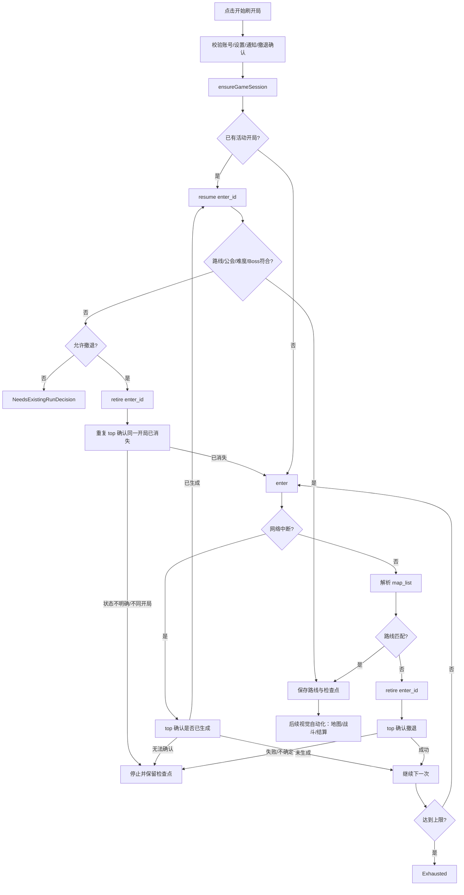

# Xiaomi Reroll Feasibility Audit

检查日期：2026-09-13（Australia/Sydney）

本报告是只读架构审计。本轮没有执行小米登录、没有读取或保存账号凭据、没有发送游戏请求、没有进入/撤退真实开局、没有修改协议或 UI，也没有 commit/push。

## Executive Summary

当前不能把 Xiaomi 支持描述为“只替换认证层即可完成”。原项目已经把“渠道 SDK 会话”和“游戏服会话”分成两层，黎明界工作流也通过 `LabyrinthApi` 抽象了 `top / enter / resume / retire`；但唯一的具体实现 `BilibiliLabyrinthApi` 接收的是 `BilibiliGameSession`，而游戏登录和 HTTP 协议实现仍包含 B 服包名、B 服 SDK 登录路径、渠道字段、游戏包证书/版本和固定协议参数。

本轮推荐：**暂不实现内置 Xiaomi；先保留外部网页作为现有可用路线，并设计一个不携带凭据的低风险会话实验；只有确认小米客户端能产生与游戏服兼容的会话、且确认黎明界响应结构一致后，才进入内置 Provider 设计。**

Confidence：**Medium**。源码边界和 B 服数据流证据充分；小米游戏服务器端协议、外部网页后端和真实小米会话尚未验证。

## Project State

- 分支：`compat/xiaomi-ldplayer`
- HEAD：`6b69920 Rename home header to 黎明界助手`
- 上一阶段修改尚未提交，工作区仍有 3 个修改文件、2 个新增 Kotlin 文件和 `docs/` 未跟踪内容。
- 本轮只新增本报告，未修改业务源码。
- 雷电当前只读确认的游戏包是 `com.bilibili.priconne.mi`；`com.bilibili.priconne` 未安装。

## Existing Reroll Architecture

### UI 到服务端

真实调用链如下：

```text
Compose LabyrinthScreen
  -> LabyrinthController.start()
  -> 请求 LabyrinthRerollService 前台服务
  -> LabyrinthController.startFromService()
  -> ensureGameSession()
  -> BilibiliNativeLoginCoordinator（必要时登录）
  -> BilibiliGameSession
  -> BilibiliLabyrinthApi
  -> LabyrinthRerollWorkflow
  -> RoomLabyrinthRouteStore / CheckpointStore
```

用户点击“开始刷开局”后，UI 会先校验账号、难度、通知权限和是否允许撤退现有开局。前台服务只负责保活、通知和时间上限；实际网络工作由 Controller 协程执行。

### 工作流实际行为

`LabyrinthRerollWorkflow.run()` 的实际顺序是：

1. 调用 `top()` 读取当前黎明界状态。
2. 若已有 `enter_id`，调用 `resume(enter_id)` 读取地图，使用 `LabyrinthOpeningRouteMatcher` 检查公会、难度、每个区域的路线、第三块类型以及区域 3/5 Boss。
3. 若已有开局符合条件，保存路线并结束；若不符合，等待用户允许后调用 `retire()`，再用多次 `top()` 确认服务端确实没有同一开局。
4. 没有活动开局时调用 `enter(guild_id, difficulty)`。
5. 对返回的 `map_list` 做路线搜索。匹配成功就保存 `enter_id`、完整节点和当前节点；不匹配就 `retire()` 并进入下一次尝试。
6. 网络中断时不会盲目重复有副作用的请求：`enter` 中断后先 `top()` 确认是否已经生成开局；`retire` 中断后也先确认状态。

最大尝试次数是 800；`rerollUntilFound=true` 时工作流循环本身没有固定尝试上限。前台服务另有约 5 小时 55 分钟运行上限。`top` 最多重试 3 次，退避 1 秒、2 秒；撤退请求最多 3 次，退避 1 秒、2 秒。Controller 对游戏会话被拒绝最多重新建立会话 3 次。

路线成功后，Room 保存的是路线和检查点，不是账号密码或完整 SDK 会话。后续视觉自动化模块消费保存的节点，执行 Accessibility 点击、MediaProjection 截图、角色/遗物识别和战斗结算。当前网络协议没有 `finish`、`clear`、`reward` 或 `get_map` 方法；`resume` 是读取现有地图，最终结算由视觉状态机处理。视觉状态机在最终结算页返回黎明界主页后才标记完成；它没有把“筛到目标开局”与“自动通关”混成一个网络 API。

## Reroll State Machine



## top / enter / resume / retire

### `top()`

源码请求路径是 `labyrinth/top`，无业务字段；响应读取 `enter_id`、`guild_id`、`difficulty` 和已解锁难度列表。它用于判断是否存在活动开局、读取当前开局的公会/难度，并在网络中断后确认服务端状态。请求仍经 `BilibiliGameSession.request()`，所以当前实现不能证明它可被 Xiaomi 会话直接调用。

### `enter()`

源码请求路径是 `labyrinth/enter`，发送两个整数：`guild_id` 和 `difficulty`。响应要求有 `enter_id` 和 `map_list`；每个节点解析为 area、column、row、block_id、block_type、quest_id、后继节点和区域末点标记。它只生成一次候选开局，路线是否符合由本地 matcher 判断。

### `resume()`

源码请求路径是 `labyrinth/resume`，发送 `enter_id`。它用于读取现有地图和当前 `block_id`，支持恢复中断的状态及检查已有开局。

### `retire()`

源码请求路径是 `labyrinth/retire`，发送 `enter_id`，响应成功只表示请求层成功；工作流随后还会多次 `top()` 验证开局确实消失。它是有副作用的请求，所以不应在网络超时后直接盲重试。

这些方法的业务参数看起来是游戏服的黎明界对象，而不是 Bilibili SDK 对象；但当前 `BilibiliLabyrinthApi` 和底层加密会话仍是 B 服具体实现。因此更准确的结论是：**API 抽象可视为“逻辑上渠道无关”，具体 HTTP 协议是否渠道无关尚未证实。**

## Bilibili Authentication Boundary

当前认证实际上有两层。

第一层是 Bilibili SDK 登录：`BilibiliLoginCoordinator` 使用账号库中的登录材料调用 B 服 SDK endpoint，处理 RSA 密钥协商、加密密码、验证码和返回的 SDK 会话。`SdkSession` 只包含 `uid`、`accessKey` 和更新时间；存储实现是 Android Keystore 加密的 SharedPreferences。报告不记录这些字段的真实值。

第二层是游戏服登录：`BilibiliNativeLoginCoordinator` 从 SDK 会话开始，调用 `BilibiliGameGateway.loginAndLoadProfile()`。具体 Gateway 先发现游戏服务器、读取维护状态，再发送游戏 `tool/sdk_login`、`check/game_start` 和 `load/index`。成功后返回 `GameAccountProfile` 和 `BilibiliGameSession`。

从 `GameProtocolGateway` 返回 `BilibiliGameSession` 的位置开始，应用持有的是游戏服会话，而不是可直接用于 Bilibili SDK 登录的账号密码。游戏会话包含：

| 数据 | 类型 | 来源 | 生命周期/缓存 | 判断 |
|---|---|---|---|---|
| `profile.viewerId` | `Long` | 游戏服 `load/index` 的用户信息 | 随本次游戏会话 | 游戏服对象 |
| `profile.userName` | `String` | 游戏服用户信息 | 随本次游戏会话 | 游戏服对象 |
| `profile.teamLevel` | `Int` | 游戏服用户信息 | 随本次游戏会话 | 游戏服对象 |
| `profile.appVersion` | `String` | 本地游戏包版本 | 随协议 profile | 包/协议对象 |
| `sid` 派生的 `SID` header | `String` | 游戏服响应头 | 保存在内存 `ClientState` | 游戏协议对象，值不写报告 |
| `request_id` 派生的 `REQUEST-ID` header | `String` | 游戏服响应头 | 保存在内存 `ClientState` | 游戏协议对象，值不写报告 |
| 当前 `viewer_id` | `Long` | 加密请求/响应头 | 更新内存状态 | 游戏服对象 |
| `enter_id` | `Long` | 黎明界 `top/enter` | Room 路线/检查点可保存 | 黎明界运行对象 |

`SdkSession` 由 `AndroidKeystoreSdkSessionStore` 缓存，成功的 `BilibiliGameSession` 目前只在 `GameSessionRegistry` 中保存；默认 Application 使用内存 registry，因此进程重启后需要重新建立游戏会话。会话被游戏服拒绝时 Controller 删除 registry，并最多重新执行 3 次登录链。

验证码有两处边界：SDK 登录验证码和游戏服风险验证码。当前允许 UI 人工提交验证码；代码没有实现自动短信/验证码绕过。缓存的 SDK 会话被游戏服拒绝时会删除，再走完整登录；源码没有独立的定时 refresh API。

## HTTP and Protocol Coupling

进入 `protocol/labyrinth/` 后，调用者不再直接调用 Bilibili SDK；它只调用 `BilibiliGameSession.request(path, fields)`。但 concrete session 的底层请求仍有明显渠道和版本耦合：

- 游戏包查询固定为 `com.bilibili.priconne`，读取该包的版本和签名摘要。
- 游戏 profile 固定 `GAME_ID`、服务器 ID、Unity/资源版本、`PLATFORM`/`CHANNEL-ID` 等字段。
- 游戏登录字段包含 `uid`、`access_key`、`platform`、`channel_id`；这些值来自 B 服 SDK/当前实现约定。
- 游戏请求使用 MessagePack、AES-CBC 加密和每次请求的临时密钥；响应头中的 `sid`、`request_id`、`viewer_id` 更新内存状态，并派生后续 header。
- 路径发现、维护状态、`tool/sdk_login`、`check/game_start`、`load/index` 都在 BilibiliGameProtocolGateway 中。

因此不能仅替换 `BilibiliNativeLoginCoordinator` 就得到 Xiaomi 支持。至少还要验证/替换游戏 package profile、渠道登录到游戏服的交换、游戏 headers/字段、签名/加密规则以及版本和资源参数。

## Xiaomi Client Read-only Audit

雷电只读查询结果：

| 项目 | 结果 |
|---|---|
| package | `com.bilibili.priconne.mi` |
| versionName / versionCode | `11.7.2` / `354` |
| minSdk / targetSdk | `21` / `30` |
| primary ABI | `x86_64` |
| launcher | `com.bilibili.priconne.bili.SplashActivity` |
| game Activity | `com.bilibili.priconne.MainActivity`（Unity Activity） |
| Xiaomi components | `com.xiaomi.gamecenter.sdk.MiGameService`、`MiOauthProvider`、多个 Mi 登录/风险/支付 Activity |
| Bilibili components | `MainApplication`、Neuron provider/service、Bilibili Activity/provider |

本次只读取 `pm path`、`dumpsys package` 和 APK manifest。没有读取 shared preferences、databases、cookies、私有文件或 token，没有 root 操作。Manifest 证明该 APK 集成了小米游戏中心 SDK，但不能证明外部助手可以合法或技术上复用它的内部登录状态。

小米官方公开文档说明，联运 SDK 登录回调通常产生 `uid`、`sessionId` 和昵称；网络游戏还要求把 uid/session 提交到开发者服务端验证，并且每次启动游戏都应重新获取最新账号信息。[小米游戏联运 SDK 登录文档](https://dev.mi.com/xiaomihyperos/documentation/detail?pId=1423) 这说明 Xiaomi 的渠道会话与游戏服务端会话在概念上也是两层，不能把 `sessionId` 直接当作本项目 `BilibiliGameSession`。具体到《公主连结》小米服仍需该游戏的实际接入协议或一次受控验证。

## Xiaomi Integration Boundary

如果未来实现内置 Xiaomi，最小合理边界不是直接复制 Bilibili 类，而是增加一个能把渠道登录结果转换成游戏会话的 provider：

```text
Xiaomi SDK / approved login
        -> Xiaomi channel session (uid, sessionId, metadata)
        -> game-server login/profile exchange
        -> GameSession (viewerId, profile, request state)
        -> common LabyrinthApi
        -> common LabyrinthRerollWorkflow
```

概念接口应更接近：

```kotlin
interface GameSessionProvider {
    suspend fun obtain(account: StoredAccount, action: LoginAction): GameSessionResult
    suspend fun invalidate(accountId: Long)
}

interface GameSession {
    val profile: GameAccountProfile
    suspend fun request(path: String, fields: LinkedHashMap<String, Any?>): GameSessionResult
}
```

这只是审计得到的接口方向，本轮没有写入源码。若 Xiaomi 的 `request` 加密、headers、登录路径和响应 schema 与 B 服不同，应由 `XiaomiGameSession`/`XiaomiGameGateway` 实现，而不是在 workflow 中写渠道分支。

## Can Existing Workflow Be Reused?

可以高度复用，但不能承诺 100%。在满足“有效的 Xiaomi `GameSession` 能以相同语义返回黎明界数据”的前提下，以下部分可以保持共用：

- `LabyrinthRerollWorkflow`
- `LabyrinthRouteSearcher` / `LabyrinthOpeningRouteMatcher`
- `top`、`enter`、`resume`、`retire` 的 `LabyrinthApi` 业务接口
- 公会、难度、路线、第三块类型、区域 3/5 Boss 过滤
- Room 路线和检查点保存
- Accessibility、MediaProjection、OCR、角色/遗物识别和结算视觉状态机

需要重新验证或替换的部分：

- Xiaomi SDK 登录调用线程、Activity/context 生命周期、隐私同意和风险回调
- 渠道 uid/sessionId 到游戏服 `GameSession` 的交换
- 游戏包名、版本、证书摘要、platform/channel 字段
- 游戏服务器发现、登录、签名/加密、SID/request-id 更新规则
- 游戏服返回的用户 profile 和黎明界 `map_list` 字段
- 会话失效、刷新和重新登录的错误码映射

所以 Q5 的准确回答是：**路线搜索和工作流有条件地复用；认证层可以成为替换点，但当前具体游戏协议层也需要一个 Xiaomi 实现，不能只换一层。**

## Session Persistence

现有 Room `accounts` 表只保存 alias、固定 `server_id=cn-bilibili`、可选 game UID 和加密凭据 key。密码/登录 ID 由 CredentialStore 保存，SDK 会话由 Keystore store 保存，游戏会话由内存 registry 保存。

若未来做 Xiaomi，最小模型变化取决于官方 SDK 的授权方式：

1. 如果 Xiaomi 只需系统/游戏 SDK 每次交互返回短期 session，可新增 `server_id=cn-xiaomi` 和 Xiaomi credential/session store，不把 sessionId 当密码。
2. 如果同一账号同时需要渠道会话和游戏会话，应保持两层存储键，分别记录过期/失效原因，并在 `GameSessionProvider` 统一失效。
3. 如果长期无人值守依赖设备绑定或每次启动必须交互，现有内存 GameSessionRegistry 不足，需要设计安全的、可过期的游戏会话缓存；这应在确认协议后再改 schema。

当前不能确认 Xiaomi session 是否能被外部应用直接获取，也不能确认游戏服务器是否接受从助手发出的 session。没有这两个证据前，不应改数据库模型。

## External Web Reroll

对用户给出的 `http://121.5.78.193:8081/daily/account/aaa` 只做了不带 Cookie 的公开页面检查：HTTP 200，标题为 `AutoPCR`，返回 909 字节 HTML，引用 `/daily/assets/index-Dw_q-1ZO.js`。静态 JS 中可以看到 `fetch`、`EventSource` 以及 `/daily/api/query_validate`、`/daily/login`、`/daily/validate` 等字面量。没有登录、没有提交表单、没有调用账号任务接口、没有保存响应正文，也没有访问用户私有页面。

这些事实只能说明存在公开前端和可能的服务端/事件流入口，不能说明网页如何取得小米账号、如何调用游戏协议、是否保存 token，或是否真的执行了同一套路线算法。网页内部实现和服务器日志属于 Unknowns。

## Facts, Unknowns, and Hypotheses

### Facts

- 原项目的 B 服流程是 SDK session → game login/profile → `BilibiliGameSession` → 黎明界 API。
- 当前 concrete game protocol 固定查询 B 服游戏包和 B 服参数。
- 黎明界工作流有 `top / enter / resume / retire`，并具有路线 matcher、检查点、网络确认和会话重建逻辑。
- Xiaomi APK manifest 集成 Xiaomi Game Center SDK；其公开 package metadata 与 B 服 package 不同。
- 外部网页公开入口可以返回 AutoPCR 页面和静态 JS；其后端账号流程未认证调查。

### Unknowns

- Xiaomi 游戏服是否与 B 服共用 `labyrinth/*` 路径、字段、加密和 response schema。
- Xiaomi SDK sessionId 是否能通过官方允许的应用集成流程换成该游戏的 game session。
- 小米游戏是否需要不同的游戏服务器、资源版本、证书摘要、渠道号或额外签名。
- 外部网页是否使用官方授权接口、模拟器登录态、后端保存的账号授权，或其他方式。
- 网页刷开局后产生重新登录/异地登录现象的精确服务器原因。

### Hypotheses about the logout observation

以下都是推测，不是本轮事实结论：

1. 网页后端可能为同一账号建立了新的游戏 session，服务器的单点登录策略使旧 session 失效。
2. 网页可能使用不同的设备标识、IP、渠道登录上下文或版本信息，触发风险控制或 session refresh。
3. 网页可能只执行服务端刷开局，但游戏客户端随后重新建立 session，用户看到的“异地登录”可能是重新登录提示而非 IP 本身导致。

要验证这些推测，需要在不读取 token 的前提下，由用户在测试账号上记录刷前/刷后游戏是否被要求重连、时间戳、游戏前台提示和非敏感 HTTP 状态；还需要网页运营方或服务端日志确认 session invalidation 原因。本轮不执行实验。

## Architecture Options

### Option A: App-internal Xiaomi

优点是 Android 自动执行可以共享本地 UI、Accessibility、MediaProjection、路线结果和状态提示，正常 session 有效期间更有机会形成无人值守循环；未来 Huawei/OPPO 可以各自提供 provider。

缺点是需要官方允许的 Xiaomi SDK/登录接入、游戏服会话交换、包签名/版本/设备参数和 session 生命周期处理；还要面对渠道 SDK 更新、隐私/实名流程、风险验证和 upstream 合并冲突。当前证据不足以承诺成功。

### Option B: External Web Reroll Provider

优点是用户已经观察到小米服网页能完成类似刷开局功能，短期开发量最小，能把渠道认证复杂度留在现有服务端；网页也可能已经实现了小米版本的协议细节。

缺点是远程服务依赖、网页改版风险、账号授权边界不透明、服务器停机风险和用户观察到的重新登录/异地登录现象。它与 Android 本地视觉自动化的衔接需要一个明确、合法且稳定的结果接口；本轮没有验证该接口。

### Option C: Windows/local direct interface

如果只是把已有 B 服 HTTP 调用搬到 Windows，本质上仍缺少 Xiaomi game session 和协议证据。直接调用服务器还会扩大凭据、设备指纹和账号安全风险。现有仓库没有发现一个公开、独立、无需游戏会话的本地接口；因此 C 暂不作为可行独立方案。

### Comparison

| 维度（1 最差，5 最好） | A 内置 Xiaomi | B 外部网页 | C 本地直连现有接口 |
|---|---:|---:|---:|
| 初始开发难度 | 2 | 4 | 1 |
| 长期维护 | 3 | 2 | 1 |
| 账号边界可控性 | 4（需官方流程） | 2 | 1 |
| 异地登录风险可控性 | 3 | 1 | 1 |
| Session 过期处理 | 3 | 2 | 1 |
| 正常运行稳定性 | 3 | 3 | 1 |
| 速度 | 4 | 3 | 3 |
| 与 Android 自动执行衔接 | 5 | 2 | 2 |
| 远程服务器依赖 | 3 | 1 | 1 |
| 长时间无人值守潜力 | 4 | 3 | 1 |
| Huawei/OPPO 扩展能力 | 4 | 2 | 1 |
| upstream 合并难度 | 3 | 2 | 1 |

分数是架构判断，不是实测性能。B 的“用户已能使用”是用户描述，不等于本轮验证；A 的长期分数取决于官方会话和游戏协议验证。

## Complexity Estimate

Xiaomi Auth complexity：**HIGH**。

拆分如下：

- 取得渠道授权：HIGH。官方文档要求 SDK 初始化、隐私合规、Activity 生命周期和开发者侧应用配置；登录回调产生 uid/sessionId。[小米登录文档](https://dev.mi.com/xiaomihyperos/documentation/detail?pId=1423)
- 取得游戏 session：VERY HIGH（当前证据）。必须确认小米渠道 session 如何绑定《公主连结》游戏账号，以及游戏服是否接受外部助手建立的 session。
- 缓存和 refresh：MEDIUM。代码可复用现有两层 store 思路，但过期规则未知。
- 验证码/风险：HIGH。小米 SDK 可能弹出登录、隐私、实名或风险 Activity；正常 session 期间可以人工介入异常，但回调状态必须可恢复。
- 设备信息：HIGH。现有 B 服 profile 使用包版本、签名、Android/设备字段；Xiaomi 包 metadata 已不同。
- 签名/加密：VERY HIGH（若协议不同）。当前 B 服包含签名、MessagePack、AES 和动态 headers；不能推断 Xiaomi 相同。
- Android SDK 依赖：HIGH。当前助手没有 Xiaomi SDK 依赖和对应 manifest/config；直接引用客户端内部类也不可行。
- 版本更新风险：HIGH。渠道 SDK、游戏版本、资源版本和服务器字段都可能独立变化。

因此不建议现在把复杂度降低为“给账号表加一个渠道枚举”。

## Long-running Loop Assessment

原项目已经具备一部分长时间运行基础：后台前台服务、WakeLock、`rerollUntilFound`、有限重试、检查点、服务端状态确认、游戏会话被拒绝后的最多 3 次重建，以及视觉结算完成后返回主页的状态机。

它目前还不是已验证的“刷开局 → 自动通关 → 结算 → 无限循环”产品闭环：

- 本轮没有对真实账号运行任何网络或视觉任务。
- `LabyrinthRerollWorkflow` 成功后只保存目标开局；通关由另一个视觉自动化状态机负责。
- 视觉模块有战斗失败后请求重刷的内部衔接，但雷电小米服尚未验证。
- 外部网页可能造成旧 session 失效，且其服务端行为未知。

所以长期无人值守的首要风险不是路线搜索，而是 Xiaomi game session 的建立、失效和重新登录边界。

## Recommended Architecture

建议分两步：

1. 短期维持外部网页作为现有 Xiaomi 刷开局工具，但不要把网页内部实现猜测成项目代码；建立仅记录非敏感状态的实验，确认网页刷一次后游戏的重连表现和 session 生命周期。
2. 若实验和公开/官方资料证明 Xiaomi 能合法地产生稳定 game session，再在本项目增加 `GameSessionProvider`/`GameSession` 边界。让 Bilibili 和 Xiaomi 各自负责 channel login、game login、refresh/invalidate；让 `LabyrinthApi`、route matcher、workflow、视觉自动化保持通用。若 Xiaomi 的加密/字段不同，新增 Xiaomi game protocol implementation，而不是在通用 workflow 中写 `if (xiaomi)`。

这意味着当前推荐不是马上实现 A，而是 **B 作为现有操作路径 + A 作为有证据后的长期本地化路径**。不推荐 C。

## Proposed Next Experiment

只设计，不执行：

1. 准备一个允许测试的非生产账号，并由用户确认网页和游戏都已退出；不导出任何 token/cookie。
2. 记录刷前时间、游戏是否在线、前台显示的非敏感状态和网页是否返回成功；不抓包、不读取私有文件。
3. 只让网页执行一次最小刷开局动作；不执行连续循环、不提交真实账号凭据给本项目。
4. 观察游戏是否被要求重新登录、是否能重新进入同一账号、网页结果是否仍存在；记录时间和 UI 文字。
5. 若需要协议结论，向网页运营方索取公开 API/授权说明，或使用其公开文档；不要自行猜测接口和 session 字段。

实验成功也只能证明会话行为的一小部分，不能直接授权实现 XiaomiAuthenticator。

## Proposed Implementation Plan (not executed)

若后续证据足够，建议：

### Phase 1: contracts and fake tests

抽出通用 `GameSession`、`GameSessionProvider`、失效原因和人工介入状态；用 fake session 验证 Controller、workflow、checkpoint 和 session reset，不接真实网络。

### Phase 2: approved Xiaomi login adapter

只接官方允许的 Xiaomi SDK/API；实现隐私/Activity 生命周期、uid/sessionId 脱敏处理、过期和人工风险流程。新增包 profile 和 game protocol adapter 前，先用公开或用户授权的测试环境确认接口。

### Phase 3: controlled device validation

在单个测试账号、单个雷电实例上验证 `top → enter → retire` 的非生产行为；先做只读 `top`，再由用户明确授权有副作用的 `enter/retire`。验证三次冷启动、session 失效恢复、视觉结算后重刷，再考虑无人值守循环。

## Conclusion

1. 原软件刷开局是：取得游戏服 session，`top` 检查现有开局，必要时 `resume`/匹配/`retire`，然后 `enter` 生成地图、路线搜索、保存或撤退重试；通关结算由独立视觉自动化完成。
2. `top / enter / resume / retire` 的业务接口可以抽象为渠道无关，但当前 concrete HTTP implementation 仍是 B 服，不能证明 Xiaomi 可直接调用。
3. Bilibili-specific 边界在 SDK 登录、B 服 SDK session、B 服游戏登录、包名/签名/版本、渠道字段和 concrete game protocol；从 `GameSession` 业务接口往下才接近通用。
4. 最终游戏 session 是一个内存中的带 `GameAccountProfile` 和加密请求状态的 `BilibiliGameSession`；它不是 `SdkSession`，也不是账号密码。敏感值没有写入报告。
5. Xiaomi 理论上可以替换 provider，但必须先完成“渠道 session → game session”验证；不能只替换账号登录类。
6. Xiaomi Auth 复杂度评估为 HIGH；若游戏协议/会话交换未知，协议部分是 VERY HIGH。
7. 现有路线搜索、检查点、视觉识别和大部分工作流可以条件复用，不能承诺 100%。
8. 外部网页的优点是用户已有可用经验、初始开发量低，可能已封装渠道细节。
9. 外部网页的缺点是远程依赖、内部实现不透明、账号授权风险、异地登录/session 失效风险和 Android 衔接不确定。
10. 已确认事实是公开页面可访问、存在静态 JS 和若干登录/校验字面量，以及用户观察到网页可刷小米开局；异地登录的 IP、单点登录、设备标识和 session refresh 原因全部是待验证假设。
11. 推荐当前采用“外部网页作为现有操作路径；内置 Xiaomi 仅在会话实验和协议证据充分后实现”；不推荐直接本地直连未知接口。
12. Confidence：Medium。
13. 最小验证实验是一次非生产账号、单次网页刷开局、只记录非敏感前后 UI/重连现象，不抓 token、不执行本项目网络请求。
14. 本轮没有修改业务源码，只新增本文件。
15. `git status` 预计新增 `docs/xiaomi-reroll-feasibility.md`，上一阶段未提交的变更仍保留。
16. `git diff --stat` 只会显示上一阶段 3 个已修改 Kotlin 文件；本报告和两个 helper/test 文件属于未跟踪文件，不会出现在普通 diff stat 中。

